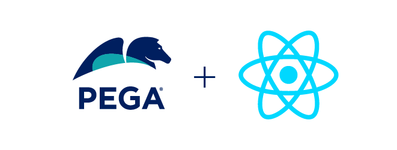

# React SDK - Release Announcement - v8.23.11

This (**main** branch) is the latest version of the React SDK. It is intended to be used with **Infinity 8.8.0+**. If you need to use **Infinity 8.7.***, please use the **release/8.8.10** branch instead of this **main** branch.

This version of the **React SDK** provides many new features that are documented here:

[What's new in the SDK?](https://docs.pega.com/bundle/constellation-sdk/page/constellation-sdks/sdks/react-sdk-updates.html) and also outlined below:

The following list shows some of the key features and changes in this 8.23.11 release:

- Added localization support. You can now implement localization in your custom and overridden SDK components.

- Updated the lint settings in the DX Component Builder to enable publishing custom components with lint errors or warnings. You can modify the lint setting (lintAction) in the sdk-config.json file from “show” to “block” to disable publishing components with lint errors or warnings.

- Updated support for the following npm packages:
  - @pega/react-sdk-components: v8.23.11
  - @pega/react-sdk-overrides: v8.23.11
  - @pega/dx-component-builder-sdk: v8.23.16

For more information about the react-sdk-components and react-sdk-overrides packages, and enhancements and bug fixes in the packages, click [here](https://github.com/pegasystems/react-sdk-components/blob/master/packages/react-sdk-components/doc/KeyReleaseUpdates.md).

---

***IMPORTANT:***  Please follow the guidelines documented here if you are upgrading from a previous version of React SDK: [Upgrading the SDK](https://docs.pega.com/bundle/constellation-sdk/page/constellation-sdks/sdks/upgrading-sdk.html)

If you want to continue using the previous release you can checkout [release/8.8.10](https://github.com/pegasystems/react-sdk/tree/release/8.8.10)

---

# Overview

The **React SDK** provides Pega customers with the ability to build DX components that connect Pega’s ConstellationJS Engine APIs with a design system other than the Pega [Constellation Design System](https://design.pega.com).

The React SDK differs from out-of-the-box Constellation design system because it provides and demonstrates the use of a React design system that is not the Pega **Constellation** design system. The alternative design system used in this React SDK is [Material UI](https://mui.com/).

A **summary of the latest updates** to the **@pega/react-sdk-components** and
**@pega/react-sdk-overrides** used by the React SDK can be found in
[react-sdk-components KeyReleaseUpdates.md](./node_modules/@pega/react-sdk-components/lib/doc/KeyReleaseUpdates.md).

 

# Prerequisites

## Pega Infinity Server and Constellation-enabled Application

This version of the React SDK assumes that you have access to a Pega Infinity server (**8.8.0+**) running an application that is configured to run using the Constellation UI service. _(If you need to use Infinity 8.7.*, please use the **release/8.8.10** branch instead of this **main** branch.)_

The **MediaCo** sample application is already configured as a Constellation application and can be found in the React SDK download associated with this repo which is available at [https://community.pega.com/marketplace/components/react-sdk](https://community.pega.com/marketplace/components/react-sdk). The OAuth 2.0 Client Registration records associated with the **MediaCo** application are available in the same React SDK download. For more information about the MediaCo sample application, see [MediaCo sample application](https://docs.pega.com/bundle/constellation-sdk/page/constellation-sdks/sdks/mediaco-sample-application.html).

The **React SDK** has been tested with:
- node 18.12.1/18.13.0
- npm 8.19.2/8.19.3

Future updates to the SDK will support more recent LTS versions of node as Constellation supports them.

**Before** installing and running the SDK code, refer to [Downloading the Constellation SDK files](https://docs.pega.com/bundle/constellation-sdk/page/constellation-sdks/sdks/installing-constellation-sdks.html) for steps to prepare your Infinity server and node environment so you can proceed with the steps in the next section.

 

---
# Installing and Running the Application
The following procedures provide an overview of installing Constellation SDKs and running the application. For detailed documentation, see [Installing and configuring Constellation SDKs](https://docs.pega.com/bundle/constellation-sdk/page/constellation-sdks/sdks/installing-configuring-constellation-sdks.html).

# Developing with the SDKs
You can find more details on how to integrate the latest React SDK into your development workflow and also instructions on the new using the new DX Component Builder for SDK features.

see [Development](https://docs.pega.com/bundle/constellation-sdk/page/constellation-sdks/sdks/development.html)

# Troubleshooting
Stuck?  Look at our [Troubleshooting Constellation SDKs](https://docs.pega.com/bundle/constellation-sdk/page/constellation-sdks/sdks/troubleshooting-constellation-sdks.html) which covers resolutions for most of the common problems.

---

   ## License

This project is licensed under the terms of the **Apache 2** license.

>You can see the full license [here](LICENSE) or directly on [apache.org](https://www.apache.org/licenses/LICENSE-2.0).

 

---

## Contributing

We welcome contributions to the React SDK project.

Refer to our [guidelines for contributors](./docs/CONTRIBUTING.md) if you are interested in contributing to the project.

 

---

## Additional Resources

* [**KeyReleaseUpdates.md**](./node_modules/@pega/react-sdk-components/lib/doc/KeyReleaseUpdates.md): A summary of the latest updates to the **@pega/react-sdk-components** and
**@pega/react-sdk-overrides** used by the React SDK can be found in the
[react-sdk-components package's **KeyReleaseUpdates.md**](./node_modules/@pega/react-sdk-components/lib/doc/KeyReleaseUpdates.md).
  * To see if there are updates in the @pega/react-sdk-components and
  @pega/react-sdk-overrides packages published in a newer version than is
currently installed, you can check the [package's main GitHub repo's **KeyReleaseUpdates.md**](https://github.com/pegasystems/react-sdk-components/blob/master/packages/react-sdk-components/doc/KeyReleaseUpdates.md).
* [**Material UI**](https://v4.mui.com/)
* [**Constellation SDKs Documentation**](https://docs.pega.com/bundle/constellation-sdk/page/constellation-sdks/sdks/constellation-sdks.html)
* [**Troubleshooting Constellation SDKs**](https://docs.pega.com/bundle/constellation-sdk/page/constellation-sdks/sdks/troubleshooting-constellation-sdks.html)
* [**MediaCo sample application**](https://docs.pega.com/bundle/constellation-sdk/page/constellation-sdks/sdks/mediaco-sample-application.html)
